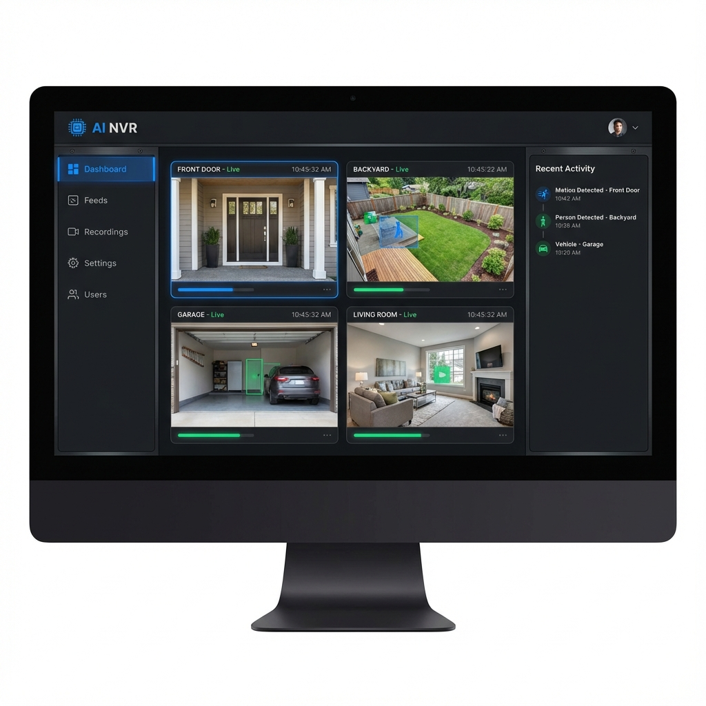

# AI NVR System

A self-hosted Network Video Recorder (NVR) with AI-powered motion detection, email notifications, and local recording management.



## Features

- **Live Streaming**: Low-latency RTSP streaming with optimized FFmpeg settings.
- **Motion Detection**: AI-based motion detection with adjustable sensitivity (Low, Medium, High, Very Low).
- **Home/Away Mode**: Toggle notification delivery. "Home" mode disables email alerts, while "Away" mode enables them.
- **Notifications**: Email alerts with snapshots when motion is detected (in Away mode).
- **Activity Log**: Compact, real-time log of all motion events and system status.
- **Recording**: Continuous or event-based recording with automatic cleanup (24-hour retention).
- **User Management**: Role-based access control (Admin/Viewer).

## Tech Stack

- **Frontend**: React, Vite, TailwindCSS
- **Backend**: Node.js, Express, SQLite
- **Video Processing**: FFmpeg
- **Deployment**: Docker & Docker Compose

## Prerequisites

- Docker & Docker Compose
- Node.js 18+ (for local development)

## Setup

### Using Docker (Recommended)

1.  Clone the repository:
    ```bash
    git clone https://github.com/wyliebutler/ai-nvr.git
    cd ai-nvr
    ```
2.  Start the application:
    ```bash
    docker compose up -d --build
    ```
3.  Access the dashboard at `http://localhost:7770`.

### Default Credentials

- **Username**: `admin`
- **Password**: `admin123`

> [!IMPORTANT]
> Please change this password immediately after logging in.

### Local Development

1.  **Server**:
    ```bash
    cd server
    npm install
    npm run dev
    ```
2.  **Client**:
    ```bash
    cd client
    npm install
    npm run dev
    ```

## Configuration

- **Motion Sensitivity**: Adjust in the Settings page.
- **Email Settings**: Configure SMTP details in the Settings page.
- **Log Retention**: Logs and recordings are automatically cleaned up after 24 hours.

## License

[MIT](LICENSE)
